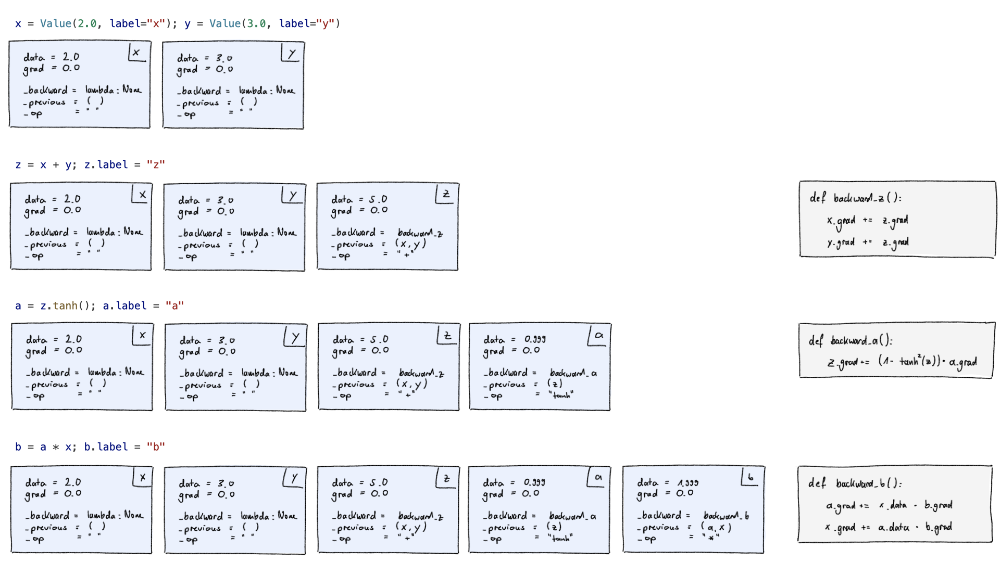
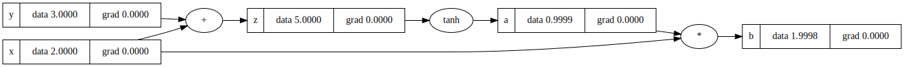
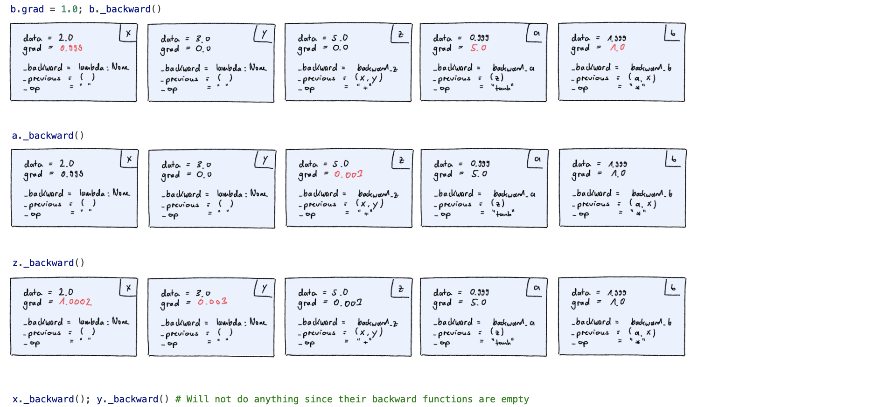
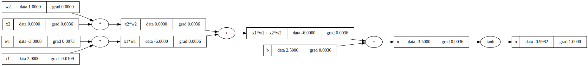

# 📚 Understanding Backpropagation 📚

This repository is built upon Andrej Kaprthy's [lecture on micrograd](https://www.youtube.com/watch?v=VMj-3S1tku0&list=PLAqhIrjkxbuWI23v9cThsA9GvCAUhRvKZ) and includes both the implementation details from the lecture as well as my personal notes. The core source code for micrograd is housed in `src/minigrad.py`. In the `src` directory, you'll also find notebooks that demonstrate a variety of examples with different complexity levels.

## 🐜 Mini Example

Let's construct a simple computational graph to carry out a basic mathematical operation:

```
x = 2.0
y = 3.0
z = x + y
a = tanh(z)
b = a * x
```

At the end, we will calculate the gradient of `b` with respect to all the other variables. Please refer to the corresponding Jupyter notebook (`src/mini_example.ipynb`) for the complete source code.

**Forward Pass**

Let's proceed step by step, building up the computational graph and performing the forward pass. The following image depicts the state of the individual Value objects after each line of code.



The corresponding computational graph after the forward pass looks like this:



**Backward Pass**

Next, we calculate the gradients of `b` with respect to all other variables in the graph. In other words, we determine how we would need to adjust `x`, `y`, `z`, and `a` to increase or decrease b.



The corresponding computational graph after the backward pass looks like this:


## 🐀 Single Neuron

Now, it's straightforward to construct the graph for a single neuron used in artificial neural networks and calculate the gradients of the output with respect to the weights. The calculation is defined as:

```
# input
x1 = 2.0
x2 = 0.0

# weights and bias
w1 = -3.0
w2 = 1.0
b = 2.5

# output
o = tanh(x1*w1 + x2*w2 + b)
```
The corresponding computational graph, including the gradients, looks like this:


